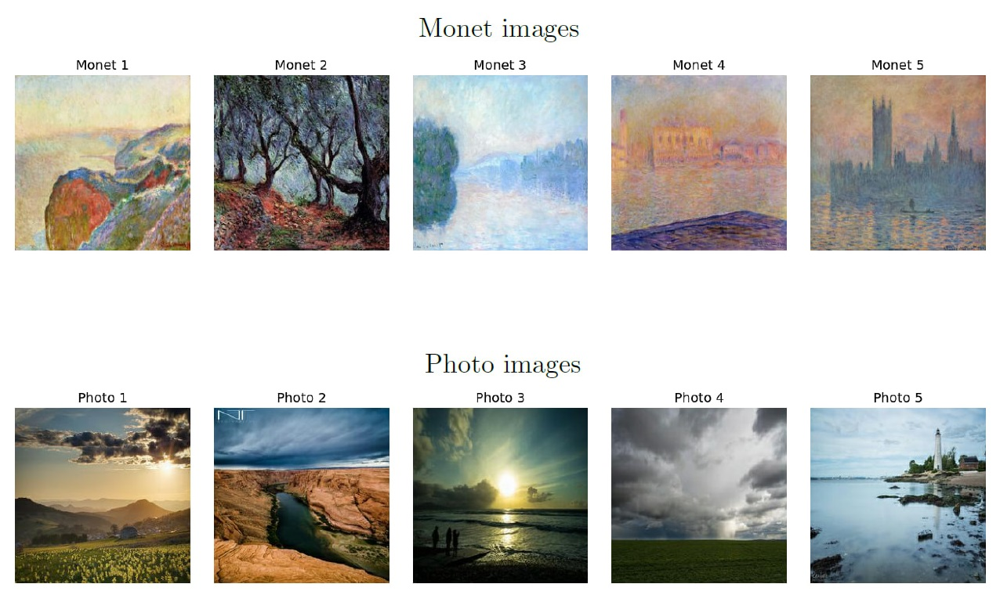
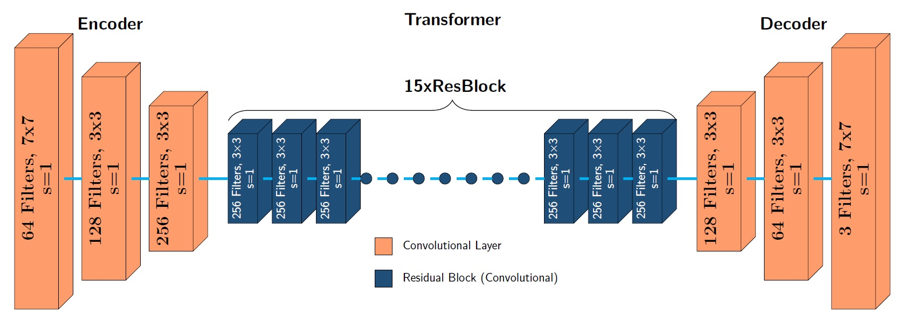
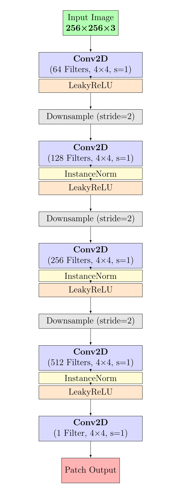
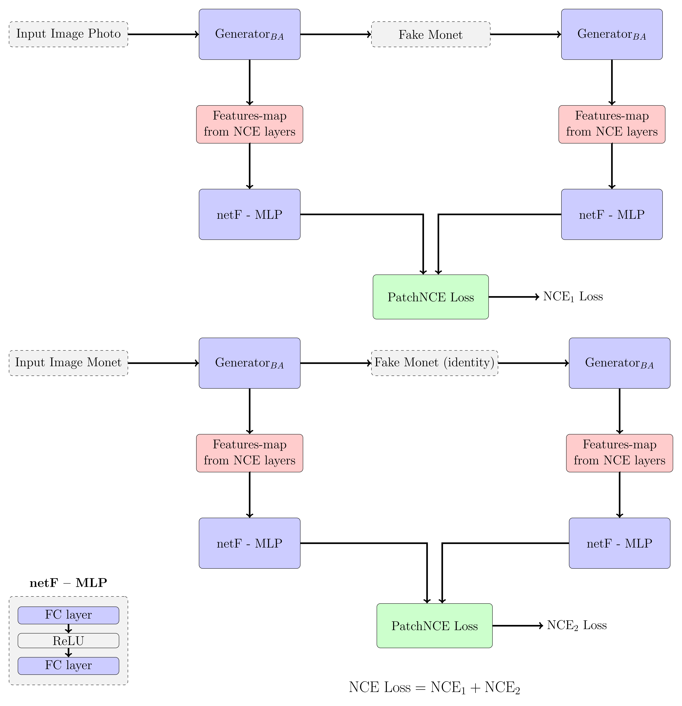
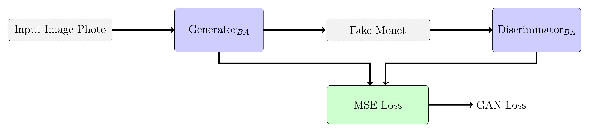
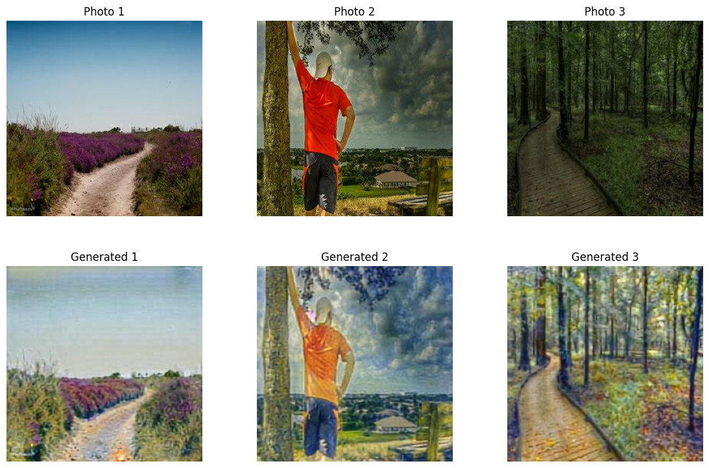

# 🎨 Unpaired Image-to-Image Translation using Contrastive Learning

This repository contains our final project for the course  
**"Generative AI Models"**,  
focused on unpaired image translation from photographs to Monet-style paintings.


## 🧠 Key Challenges

- Small Monet dataset (only 300 images)
- No paired data between Photo and Monet domains
- Achieving both realism and semantic preservation

---
## 🗂️ Dataset

| Class  | Count | Type | Size    |
|--------|-------|------|---------|
| Photo  | 7,038 | RGB  | 256×256 |
| Monet  | 300   | RGB  | 256×256 |

- **Training Set**:  
  We randomly selected 200 images from each domain provided by the [I’m Something of a Painter Myself](https://www.kaggle.com/competitions/gan-getting-started/data):  
  - **Domain A**: 200 Monet-style paintings from the `monet_jpg` folder (out of 300 total).  
  - **Domain B**: 200 real-world photos from the `photo_jpg` folder (out of 7,038 total).  

- **Image Translation**:  
  All 7,038 photos from Domain B were translated to Monet-style using our generator to create the synthetic Domain A images.

- **Evaluation Set**:  
  To evaluate the model, we used a larger, external dataset containing 1,193 Monet paintings from [this TFDS Kaggle Dataset](https://www.kaggle.com/datasets/dimitreoliveira/monet-paintings-jpg-berkeley).  
  Since this dataset includes the same 300 Monet images from the competition, we filtered those out. The remaining **893 unique Monet paintings** were used for **MiFID** evaluation against the generated images.

  📁 [893 Monet Paintings for Evaluation (Google Drive)](https://drive.google.com/drive/folders/1ZQ1aYVl646MFR2DDu6v-Ef2HLqwgXbci)

<div align="center">
  
</div>

---

## 📌 Project Overview

### 🎯 Objective

Develop a model that translates real-world **photos** into the artistic style of **Claude Monet**,  
while preserving the original image structure.

We implemented and evaluated two models:

- **Model 1**: Vanilla CycleGAN – [[Paper](https://arxiv.org/abs/1703.10593)]
- **Model 2**: Modified CycleGAN with PatchNCE (Contrastive Learning)

## 🧠 Model 1 – Vanilla CycleGAN

- Two generators (`G_AB`, `G_BA`) and two discriminators (`D_A`, `D_B`)
- Loss functions:
  - **Cycle-consistency loss**
  - **Identity loss**
  - **Adversarial loss (LSGAN)**
    
## 🧠 Model 2 – Modified CycleGAN with PatchNCE (Contrastive Learning)

Unlike the standard CycleGAN, our second model removes the cycle-consistency and identity losses  
and introduces a **PatchNCE contrastive loss** to enforce semantic correspondence between the input photo and its generated Monet-style output.

We used a **ResNet-based Generator** and a **Patch-level Feature Extractor** as part of the contrastive loss computation.


---

## 🖼️ Generated Images

Here are the generated Monet-style images for both models across different random seeds:

### 🔹 Model 1 – Generated Images
- [Seed 42](https://drive.google.com/drive/folders/1XuNJnoxluw2PhiRhzXXnUqWDxqA--uZw?usp=sharing)
- [Seed 123](https://drive.google.com/drive/folders/12IY4SbD-p7M9a1R6Wi3nVeIEhA2mUfF0)
- [Seed 2025](https://drive.google.com/drive/folders/1aldg_d-P6494W1AJRKosmTrjh5-sgyTU)

### 🔸 Model 2 – Generated Images
- [Seed 42](https://drive.google.com/drive/folders/1tTA_AQvXlsuoqm8ouDR6jOXIegdHUC7u)
- [Seed 123](https://drive.google.com/drive/folders/1JioM3EyEPU_CEb28p6a0GkqBp70T8IH2)
- [Seed 2025](https://drive.google.com/drive/folders/1ChjS3u7FerK64CL_nXxY9eNQDU6lYa5c)

---

## 💾 Download Pre-trained Weights

You can download the pre-trained model checkpoints for both Model 1 and Model 2 below:

### 🔹 Model 1 – Pre-trained Weights
- [Seed 42](https://drive.google.com/file/d/1qxm1GGGF-FXJ0NJf6dlg6eYO7K6_MWX9/view?usp=sharing)
- [Seed 123](https://drive.google.com/file/d/1EJkXs5j7CBzsVvWluo_xUGFStbTMF9_A/view?usp=sharing)
- [Seed 2025](https://drive.google.com/file/d/1W4FLw_I8Ha1dgcZihQcERy20xADDWLhN/view?usp=sharing)

### 🔸 Model 2 – Pre-trained Weights
- [Seed 42](https://drive.google.com/file/d/19i4ZTN3BfcCk-D3-XseiAmUXZ_kFtqSW/view)
- [Seed 123](https://drive.google.com/file/d/1mknQxruzqiCzI-piM9aFbY24n2mX6ftd/view)
- [Seed 2025](https://drive.google.com/file/d/1uJKwX2Wzzmk9gARsDuO2ZXLy0F_1OIYB/view)

---

### 🖼️ Architecture Overview

#### 1. **Generator (G)**
- Architecture: ResNet with 15 residual blocks (`resnet_15blocks`)
- Output: Monet-style generated image `G(x)`
<div align="center">
  
</div>

#### 2. **Discriminator (D)**
- PatchGAN discriminator classifies local 70×70 image patches as real or fake.
- Optimized via **LSGAN loss**.
<div align="center">
  
</div>

### ⚖️ Generator Loss Function
The total Generator loss consists of:
$$G_{Loss} = \lambda_{GAN} \cdot GAN_{Loss} + \lambda_{NCE} \cdot NCE_{Loss}$$

- `λ_GAN = 1.0`
- `λ_NCE = 1.0` (default, varied in ablation)
### Where:
<div align="center">
  <strong>NCE Loss (Patch-wise):</strong>
</div>
<div align="center">
  
</div>
<br>
<div align="center">
  <strong>GAN Loss:</strong>
</div>
<div align="center">
  
</div>
---


## ⚙️ Installation & Setup

#### 📓 Example Notebook  
This repository includes a ready-to-run Jupyter notebook demonstrating:

- ✅ Full training of both models (CycleGAN and Contrastive Learning)  
- 🖼️ Example image generation from the trained generators  
- 📊 MiFID evaluation for perceptual quality assessment  

You can try it out here:  
🔗 [notebooks/main_notebook.ipynb](https://github.com/DolevDahan/I-m-Something-of-a-Painter-Myself/blob/main/notebooks/main_notebook.ipynb)


### 1. 📥 Clone the repository

```bash
git clone https://github.com/DolevDahan/I-m-Something-of-a-Painter-Myself.git
```

### 2. 📦 Install dependencies

```bash
pip install kaggle
```

If you're using Google Colab:
```python
from google.colab import drive
drive.mount('/content/drive')
```

### 3. 📂 Download Dataset

1. Upload your Kaggle API key (`kaggle.json`) and run:
```bash
mkdir -p ~/.kaggle
cp kaggle.json ~/.kaggle/
chmod 600 ~/.kaggle/kaggle.json
kaggle competitions download -c gan-getting-started -p ./gan-data
```

2. Extract and organize the dataset using the provided notebook code.

Directory structure after setup:

```
I-m-Something-of-a-Painter-Myself/
├── data/
│   ├── trainA/         ← Monet images
│   ├── trainB/         ← Photo images
│   ├── testA/          ← 1 Monet image (no use- one direction BtoA)
│   └── testB/          ← Copy of Photo images
```

---

## 🧪 Training & Testing

Model training and testing were performed **directly using Python functions**, without calling shell scripts.  
We trained both models (CycleGAN and PatchNCE) using fixed seeds for reproducibility.

---

### ✅ Training Model 1: Vanilla CycleGAN

Training was done using the function `train_cycle_gan()` from the `training_vanilla_model` module.

```python
from training_vanilla_model import train_cycle_gan

save_dir = "./I-m-Something-of-a-Painter-Myself/checkpoints/model_1/Checkpoints_100"

train_cycle_gan(
    seed=42,
    path_monet='./I-m-Something-of-a-Painter-Myself/data/trainA',
    path_photo='./I-m-Something-of-a-Painter-Myself/data/trainB',
    save_dir=save_dir,
    batch_size=5,
    n_epochs=100
)
```

> We repeated this process for seeds `42`, `123`, and `2025` to evaluate consistency.

---

### ✅ Testing Model 1

After training, the generator `G_BA` was loaded using:

```python
from load_model import load_models
from generate_images_v2 import generate_images

models = load_models("./I-m-Something-of-a-Painter-Myself/checkpoints/Checkpoints_100/checkpoint_seed_42.pth")
G_BA = models["G_BA"]

generate_images(
    G_BA,
    input_dir="./I-m-Something-of-a-Painter-Myself/data/trainB/trainB",
    output_dir="./I-m-Something-of-a-Painter-Myself/output/generated_images_vanilla_model_seed_42"
)
```

---

### ✨ Training Model 2: CycleGAN and PatchNCE based

Training was performed by configuring a `Namespace` object with all hyperparameters and passing it to the `train()` function:

```python
from train import train
from argparse import Namespace

TrainOpt = Namespace(
    name='Model2_Train_seed42',
    seed=42,
    dataroot='./I-m-Something-of-a-Painter-Myself/data',
    checkpoints_dir='./I-m-Something-of-a-Painter-Myself/checkpoints',
    batch_size=4,
    train_samples=200,
    n_epochs=70,
    n_epochs_decay=30,
    lr=0.0002,
    beta1=0.5,
    beta2=0.999,
    lambda_NCE=1.0,
    gan_mode='lsgan',
    nce_layers='0,4,8,12,16',
    nce_T=0.07,
    num_patches=256,
    netG='resnet_15blocks',
    netD='basic',
    direction='BtoA',
    input_nc=3,
    output_nc=3,
    isTrain=True,
    phase='train',
    gpu_ids=[0],
    # ... other default parameters
)

train(TrainOpt)
```

---

### ✨ Testing Model 2

After training, we loaded the trained generator and used it to generate Monet-style outputs:

```python
from test import load_trained_generator
from generate_images_v2 import generate_images

# Define the same Namespace used during training
TestOpt = Namespace(
    name='Model2_Train_seed42',
    dataroot='./I-m-Something-of-a-Painter-Myself/data',
    netG='resnet_15blocks',
    gpu_ids=[0],
    isTrain=False,
    direction='BtoA',
    input_nc=3,
    output_nc=3,
    # Add any other required fields from training
)

checkpoint_path = "./I-m-Something-of-a-Painter-Myself/checkpoints/Model2_Train_seed42/latest_net_G_42.pth"
net_G = load_trained_generator(TestOpt, checkpoint_path, device='cuda')

generate_images(
    net_G,
    input_dir="./I-m-Something-of-a-Painter-Myself/data/trainB/trainB",
    output_dir="./I-m-Something-of-a-Painter-Myself/output/generated_images_model_2_seed_42"
)
```

> You can find all generated images for different seeds inside:
```
output/
├── generated_images_vanilla_model_seed_42/
├── generated_images_model_2_seed_42/
├── ...
```

---
## 📊 Evaluation – MiFID (Memorization-informed FID)

To assess the perceptual quality of the generated Monet-style images,  
we computed the **MiFID** score (Memorization-informed FID), which penalizes overfitting.

This score is calculated by dividing the standard FID by a cosine-based distance between features.
This score is calculated by dividing the standard FID by a cosine-based distance between features.
For a detailed explanation of the MiFID metric, refer to the official [Kaggle MiFID demo notebook](https://www.kaggle.com/code/wendykan/demo-mifid-metric-for-dog-image-generation-comp/notebook).

---

### 🧮 How MiFID Was Computed

The following code was used to compute MiFID for each model output:

```python
from evaluation.evaluation import calculate_kid_given_paths, distance_thresholding, model_params

# Paths to generated and real Monet images
user_images_path = "./I-m-Something-of-a-Painter-Myself/output/generated_images_model_2_seed_42"
real_images_path = "./I-m-Something-of-a-Painter-Myself/evaluation_images/monet_evaluation_jpg"

# Model for feature extraction
public_path = "./I-m-Something-of-a-Painter-Myself/code/model_2/evaluation/classify_image_graph_def.pb"

# Compute FID and cosine distance
fid_epsilon = 1e-14
images_path = [user_images_path, real_images_path]

fid_value, cosine_dist_raw = calculate_kid_given_paths(images_path, 'Inception', public_path)
cosine_distance = distance_thresholding(cosine_dist_raw, model_params['Inception']['cosine_distance_eps'])

# Final MiFID score
mifid_score = fid_value / (cosine_distance + fid_epsilon)

print("FID:", fid_value)
print("Cosine Distance:", cosine_distance)
print("MiFID Score:", mifid_score)
```


MiFID scores were computed separately for each model and seed.  
The lower the MiFID, the better the perceptual similarity to real Monet images.

### 📋 Results Summary

| Model        | Mean MiFID | Std. Deviation |
|--------------|------------|----------------|
| Vanilla      | 91.537     | 3.456          |
| PatchNCE     | 78.448     | 2.987          |

> These scores indicate that the contrastive model (Model 2) significantly outperforms the vanilla CycleGAN in terms of perceptual quality and generalization.

---

## 📊 Evaluation – MiFID

We use **MiFID** (Memorization-informed FID), which penalizes overfitting by comparing generated Monet images with unseen Monet test data.

| Model    | Mean MiFID | Std. Deviation |
|----------|------------|----------------|
| Vanilla  | 91.537     | 3.456          |
| PatchNCE | 78.448     | 2.987          |

---

## 🧪 Ablation Study – PatchNCE Weight (λ)

To evaluate the effect of the PatchNCE loss, we trained Model 2 with different values of `λ_NCE`.

| λ_NCE | MiFID   | Feature Distance |
|--------|---------|------------------|
| 1.0    | 76.711  | 0.254            |
| 0.35   | 80.272  | 0.257            |
| 0.01   | 293.404 | 0.353            |

**Conclusion**: Strong contrastive supervision (`λ = 1.0`) improves semantic alignment and training stability.

---

## 🖼️ Sample Outputs
Here is an example of the output generated by our model:
<div align="center">
  
</div>
---

## 📂 References

- [CycleGAN Paper](https://arxiv.org/abs/1703.10593)
- [Contrastive Learning of Visual Representations](https://arxiv.org/abs/2002.05709)
- [Adaptive Supervised PatchNCE Loss](https://arxiv.org/abs/2303.06193)
- [Contrastive Unpaired Translation](https://arxiv.org/abs/2007.15651)
- [MiFID Evaluation Metric](https://www.kaggle.com/competitions/gan-getting-started/overview/evaluation)
- [TFDS Monet Dataset](https://www.kaggle.com/datasets/dimitreoliveira/monet-paintings-jpg-berkeley)

---

## 👥 Authors

- **Dolev Dahan**
- **Ronel Davidov**

📫 Contact us: `dahandol@post.bgu.ac.il`, `davidovr@post.bgu.ac.il`
